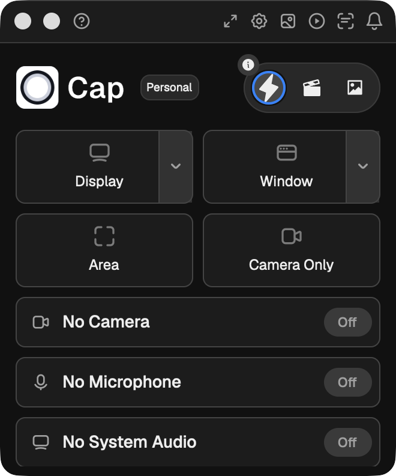
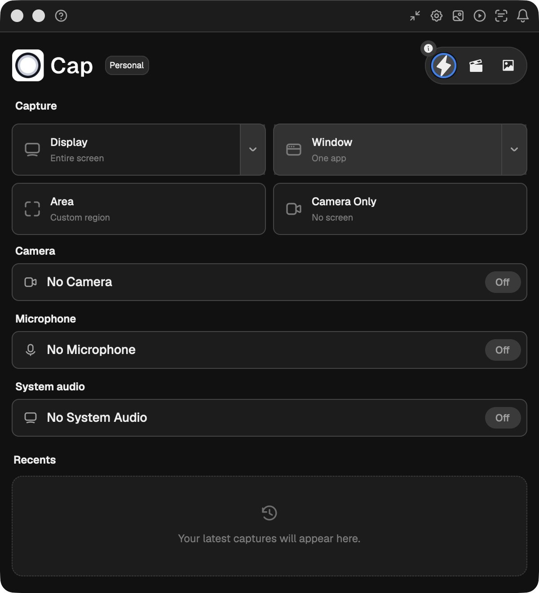

# cap-desktop-gpui

Cap's desktop app, rewritten in [gpui](https://www.gpui.rs/). No Tauri, no
webview — the whole UI is drawn by gpui and every pixel is Rust.

This is milestone 1: **the main recording window**, compact and expanded, with
real device enumeration. It is a parallel implementation, not a replacement.
`apps/desktop` is untouched and remains the shipping app.

| | |
|---|---|
|  |  |
| 330×395 | 600×660 |

## Running it

```sh
cd apps/desktop-gpui
cargo run
```

`RUST_LOG=cap_gpui=debug cargo run` for logs — note the filter is `cap_gpui`
(the binary), not `cap_desktop_gpui` (the package).

The first build takes a few minutes and about 8 GB of `target/`: gpui pulls its
own revisions of the wgpu and font stacks. Incremental builds after that are
under a second.

### Why it is a separate workspace

`Cargo.toml` declares its own `[workspace]`. The root workspace carries
`[patch.crates-io]` entries — a vendored `wgpu-hal`, a forked `tao` — that exist
only for the Tauri app and that gpui's tree does not want. Nesting a second
workspace here leaves the root `Cargo.lock`, the `cargo hakari` workspace-hack
and CI completely untouched.

`rust-toolchain.toml` pins `stable` rather than the root's 1.88.0, because
gpui's dependencies need 1.89+ (`smol_str` 0.3.6, `cosmic-text` 0.19). The
nearest toolchain file wins, so the Tauri app is unaffected.

## What is implemented

Everything below is real, not mocked.

- **Window shell.** Undecorated, transparent, 16px rounded, fixed size. Custom
  header with hand-drawn traffic lights and a scoped drag region.
- **Compact and expanded layouts.** 330×395 and 600×660. Expanding adds section
  headings, turns the capture tiles horizontal with descriptions, widens the
  control rhythm from 8px to 10px, and reveals Recents.
- **Device enumeration.** Cameras via `cap-camera`, microphones via the Cap
  `cpal` fork, displays and windows via `scap-targets` — the same crates the
  recorder uses, so the identities are the ones `cap-recording` expects. Camera
  rows show the device's best advertised format, microphone rows the config the
  device would actually open with.
- **Pickers.** Camera, microphone, display and window, each a full-body panel
  with a live filter field. Displays and windows render as a two-column card
  grid with real refresh rates and bounds.
- **Mode selector**, with the info panel behind its dot.
- **Light and dark**, following the system appearance, from the app's real
  resolved Radix values.
- **Native panel behavior.** The main window runs at window level 100 on all
  Spaces, exactly as `windows.rs` configures it — applied through a small
  `platform` module that reaches the `NSWindow` behind a gpui window via
  `raw-window-handle` (gpui exposes no level/Spaces API).
- **Recording controls bar.** The 320×150 always-on-screen panel from
  `in-progress-recording.tsx`: stop with a live timer, pause/resume, restart,
  delete, mic indicator, drag handle. A non-activating panel
  (`WindowKind::PopUp`), so its buttons work without stealing focus from the
  app being recorded. While it is up the main window hides, and the bar's own
  window is excluded from the capture.

### Layout fidelity

Metrics are transcribed from `apps/desktop`, not eyeballed, and the Tailwind
class each one came from is quoted in a comment next to it — `pl-3` and
`gap-2.5` are much easier to check against the original than `12.` and `10.`.

The colour tokens are the resolved Radix values **with the dark-mode overrides
from `apps/desktop/src/styles/theme.css` applied**. Six of the dark grays and
`gray-11` are not stock Radix, so regenerating the palette from a Radix crate
would quietly change the app's colours.

## Deviations from the Tauri app

Things that are deliberately different, and why.

| | |
|---|---|
| **Traffic lights are hand-drawn** | The Tauri main window returns `None` from `traffic_lights_position`, which routes it to `decorations(false)`; the lights are HTML there too. `titlebar: None` is the gpui equivalent. Minimize is not drawn, and zoom toggles expand/collapse. |
| **No vibrancy** | The real macOS shell is a translucent material, not `bg-gray-1`. This is the single largest visual gap. |
| **NSWindow, not NSPanel** | The Tauri app class-swizzles its windows into `NSPanel`s via `tauri_nspanel`. Here the main window stays a normal `NSWindow` and gets the observable parts — level 100, `CanJoinAllSpaces \| FullScreenPrimary` — from the `platform` module. (`WindowKind::Floating` is *not* a shortcut to this: its panel hides on app deactivation.) The controls bar *is* a real panel via `WindowKind::PopUp`, whose non-activating behavior it genuinely needs. |
| **Controls bar level 8, faithfully** | `windows.rs` raises the bar with `CGWindowLevelForKey(10)` under a constant named `kCGMaximumWindowLevelKey` — but key 10 is `kCGModalPanelWindowLevelKey` (maximum is 14), so the shipping bar actually runs at level 8. Reproduced verbatim rather than "fixed" from over here. |
| **Resize does not re-clamp** | Expand/collapse animates over 180ms with an ease-out cubic, as the Tauri app does, but does not re-clamp the window into the monitor work area afterwards — expanding near a screen edge can push the window off it. |
| **Panels instead of windows** | Mode info is the 580×340 ModeSelect *window* in the Tauri app; here it is a body panel, because there is only one window so far. The device and target pickers are body panels in both. |
| **No target thumbnails** | Display and window cards render the icon fallback the real card falls back to before its thumbnail arrives. Live previews need the capture pipeline. |
| **Search is minimal** | gpui ships no text input. Ours tracks focus, takes `key_char` so dead keys and option-layouts work, and draws a static 1px caret. No selection, no cursor movement, no blink. Escape clears, then closes. |
| **Plan badge is always "Personal"** | Which of Pro/Commercial applies comes from the license query. There is no auth or license plumbing yet, and claiming a plan would be worse than showing none. |
| **Recents is header + empty state** | Thumbnails need the recordings library. |
| **Window filter is duplicated** | The level-0 listability rule is copied from `cap_recording::sources::screen_capture` rather than imported — that crate drags in ffmpeg and the whole encode stack, which this app has no other reason to build. |

### gpui traps worth knowing

**Do not touch the window from inside `open_window`'s builder closure.**
`MainWindow::new` runs before the platform window is finished. A `resize` there
produces a window whose viewport disagrees with its scale factor — every `px()`
comes out at exactly twice its size — and a task spawned there updates the model
without ever scheduling a frame. Both failures are silent. Set the initial size
through the bounds passed to `open_window`, and start async work from `main`
once the window handle exists.

**Do not mutate AppKit window state from inside a gpui update.** `setFrame:`
and `orderFrontRegardless` synchronously fire gpui's own move/resize/frame
callbacks, which re-borrow the App — inside a window or entity update that
logs `RefCell already borrowed` and silently drops the callback. Grab the
`NSWindow` inside the update, then do the AppKit calls from a spawned task
(`platform::place_overlay_panel`).

**Titled windows cannot cover the menu bar.** Every gpui window — `PopUp`
panels included — carries `NSTitledWindowMask`, so AppKit's
`constrainFrameRect:toScreen:` pushes a display-covering window 33pt down.
The Tauri app never sees this because tao's `NSWindow` subclass overrides the
method to return the rect unchanged; `platform::install_occlusion_shim`
installs the same override on gpui's window classes.

## Parity roadmap

Sizes are the Tauri app's, from `apps/desktop/src-tauri/src/windows.rs`.

| Window | Size | Status |
|---|---|---|
| Main | 330×395 / 600×660 | **Done** — layout, devices, pickers, modes, recording, level-100 panel behavior |
| Camera preview | size×(size+56), 150–600 | **Done** — live frames, round/square/full shapes, S/L sizes, hover toolbar, corner resize, drag, persisted chrome state, capture-excluded in studio / included in instant |
| Recording controls | 320×150 | **Done** — live timer, pause/resume, restart, delete, live mic level, instant-mode mute, drag; capture-excluded, non-activating |
| Target select overlay | per display | **Done** — all four variants (display / window / area / camera-only), one transparent non-activating panel per display at the Tauri-verbatim level 7, cursor-following highlight, click-to-pin windows with app icons, draw/move/resize area selection with min-size validation, the real Start Recording flow (overlays close, bar opens, overlays excluded from capture), Escape/close dismiss |
| Window capture occluder | per display | Not started |
| Capture area | per display | Superseded — area selection is the target-select overlay's area variant; the Tauri app still registers a standalone `capture-area` window but nothing in its frontend opens it |
| Recordings overlay | per display | Not started |
| Mode select | 580×340 | Partial — exists as a panel, not a window |
| Settings | 782×775 (min 780×560) | Not started |
| Upgrade | 950×850 | Not started |
| Onboarding | dynamic, 860–1080 wide | Not started |
| Teleprompter | 560×320 | Not started |
| Editor | 1275×800 | Not started — by far the largest |
| Screenshot editor | 1240×800 (min 800×600) | Not started |

## Recording

The app records for real, through the same `cap-recording` actors the Tauri
app drives — studio and instant, screen + microphone, written into the same
recordings library (`recordingsPath` from the Tauri settings store, falling
back to `<app data>/recordings`; `CAP_GPUI_RECORDINGS_DIR` overrides both for
tests). Studio projects are finalized with `RecoveryManager::remux_if_needed`,
instant projects get `content/output.mp4` plus the
`recording-meta.json`/`project-config.json` pair, mirroring the CLI's
`finalize_completed` — a project recorded here exports cleanly with
`cap export`.

The flow matches the real app: starting opens the controls bar first (in its
"Starting" state) and hides the main window; the bar's window number is passed
to the recording actors as an excluded window so the bar never appears in the
capture; stop, delete, and a failed start all close the bar and bring the main
window back. Pause closes the live segment and resume opens the next one —
a paused recording produces exactly the multi-segment `.cap` the editor
expects. A microphone that enumerates but fails to open (Bluetooth profile
switches, Continuity devices) degrades to a no-mic recording instead of
failing the start.

Recording-specific deviations:

| | |
|---|---|
| **Bar timer, no countdown** | The countdown variant (`window.COUNTDOWN`) needs the settings store; the bar goes straight from Starting to the timer. |
| **Settings button is inert** | The bar's recording-settings popover menu is not built; the same applies to the gear button in the overlay's start cluster. |
| **No overlay blur** | The recording overlay is `bg-gray-1/80` without `backdrop-blur-xs`; this gpui rev has no per-element backdrop blur hook. The target-select overlay's liquid-glass surfaces drop their `backdrop-blur-xl` for the same reason. |
| **Escape is a focused key handler** | The Tauri app registers Escape as a *global* shortcut while the overlays are up; here it is a key handler on the overlay that holds focus (the one on the cursor's display). Escape pressed while another app is active does not dismiss. |
| **Overlay cluster is start-only** | The device row (camera/microphone selects under the start pill), the mode dropdown behind the caret, and the "What is X Mode?" link are deferred — device pickers live in the main window. The area toolbar shows the size readout but not the aspect-ratio/reset/fill/lock controls. |
| **Camera-only keeps the bubble** | The TSX inlines a camera preview into the camera-only overlay; ours keeps the separate camera preview window it already has. |
| **Camera id is DeviceID-only** | The Tauri app persists `ModelID` when a camera advertises one, so the same camera survives re-plugging into a different port. |
| **Defaults are the builder's** | `desktop_recording_defaults` (studio quality, fps caps, custom cursor) is not applied yet — it reads the Tauri settings store. |

`CAP_GPUI_AUTO_RECORD=studio:5` (or `instant:4`) arms the primary display and
drives a start/stop through the button code paths — the end-to-end check uses
it because unprivileged synthetic clicks are dropped. Add
`CAP_GPUI_AUTO_PAUSE=1` to pause for the middle third: two segments whose
summed duration is ~⅔ of wall time is the proof the pause reached the engine.
`CAP_GPUI_AUTO_CAMERA=1` selects the first camera at startup the way a click
would, opening the preview bubble; combined with `CAP_GPUI_AUTO_RECORD` it
verifies the camera track end to end.

`CAP_GPUI_AUTO_OVERLAY=display|window|area|camera` arms a target mode the way
clicking its tile does and opens the target-select overlays; on its own it
leaves them up (how the screenshots are taken), combined with
`CAP_GPUI_AUTO_RECORD` it routes the start through the overlay's own Start
button. `CAP_GPUI_AUTO_AREA=x,y,width,height` seeds the crop a drag would have
drawn (synthetic drags are dropped without Accessibility). The area variant
was verified end to end: a seeded 800×500 crop recorded a 1600×1000 (2×)
display track.

## Camera preview and app-scoped feeds

Selecting a camera spins up an app-scoped `CameraFeed` actor and opens the
preview bubble immediately, before any recording — the Tauri model. The same
applies to the microphone: an app-scoped `MicrophoneFeed` keeps a meter
running, which is what feeds the live level bar in the mic picker rows and on
the recording bar. Starting a recording locks the already-running feeds
(`feeds::camera::Lock` / `feeds::microphone::Lock`), so the preview never
stutters across a start, and the bar's mute button (instant mode only, like
the real app) flips the recording-scoped payload-zeroing mute on the mic lock.

Frames arrive as `420v` CoreMedia sample buffers on a bounded flume channel.
gpui's zero-copy `surface()` element turned out to be unusable for this on the
pinned rev — its Metal path hard-asserts `420f`, and surface primitives ignore
rounded-corner clipping (fatal when the default shape is a circle). Instead
VideoToolbox converts `420v` → BGRA in hardware, one row-copy lifts the frame
into a gpui `RenderImage`, and the previous frame's image is explicitly
dropped from the sprite atlas each frame. Cover-fit and the circular clip both
hold on the image path. Camera-window deviations: no mirroring (no flip
transform exists in this gpui rev — the toolbar button is present but
disabled), background blur cycles and persists but does not process frames
(the `cap-camera-effects` pipeline is its own unit), the window position is
not persisted per-monitor, and chrome state persists to `gpui-state.json`
next to the Tauri store rather than `localStorage`.

### The macOS 26 display-link fix

The single most important platform finding so far: on macOS 26,
`NSWindow.occlusionState` reports visible windows with an undocumented bit
(`0x2000`) instead of the documented `NSWindowOcclusionStateVisible` (`0x2`)
— and gpui only starts a window's CVDisplayLink when it sees `0x2`. Result:
**no window in this app ever received frame callbacks** — first paint, then
frozen. Every earlier "inactive repaint" workaround (250ms `refresh()` ticks)
was painting nothing; the bar's timer sat on "Starting" through entire
recordings. `platform::install_occlusion_shim` overrides `occlusionState` on
gpui's own window classes to OR the documented bit back in whenever AppKit
reports any visibility, and `apply_panel_behavior` re-fires the occlusion
handler so the link starts. With it, the bar timer ticks and the camera
renders at capture cadence while another app is frontmost. Remove the shim
when the gpui pin understands the macOS 26 bit.

Running from a dev build needs the ffmpeg dylibs the binary's install names
point at (`@executable_path/../Frameworks/Spacedrive.framework/...`):

```sh
mkdir -p target/Frameworks
ln -sfn "$(pwd)/../../target/native-deps/Spacedrive.framework" target/Frameworks/Spacedrive.framework
```

## Verifying changes

`screencapture` cannot see windows without Screen Recording permission, but
per-window capture by id works. Get the window number from
`CGWindowListCopyWindowInfo` and then:

```sh
screencapture -x -o -l<window-id> shot.png
```

Measure against it rather than trusting the eye — the 2×-scale bug above was
invisible until the compact and expanded headers were compared pixel by pixel.
