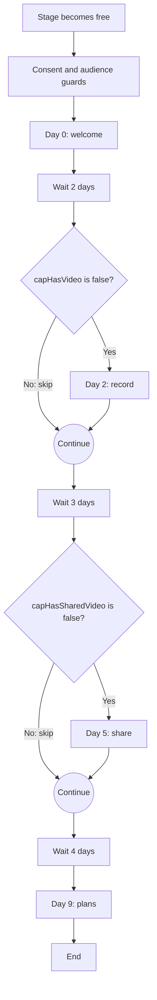
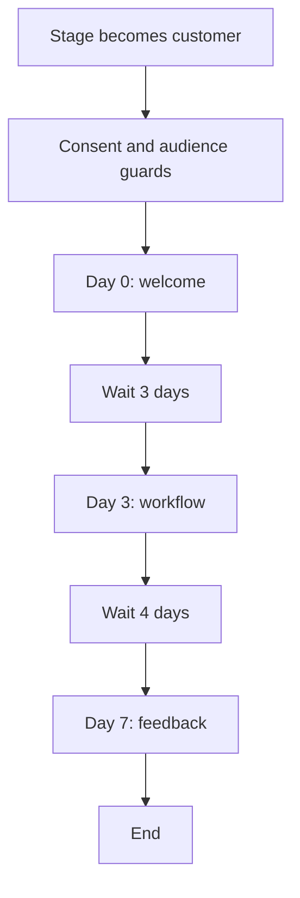
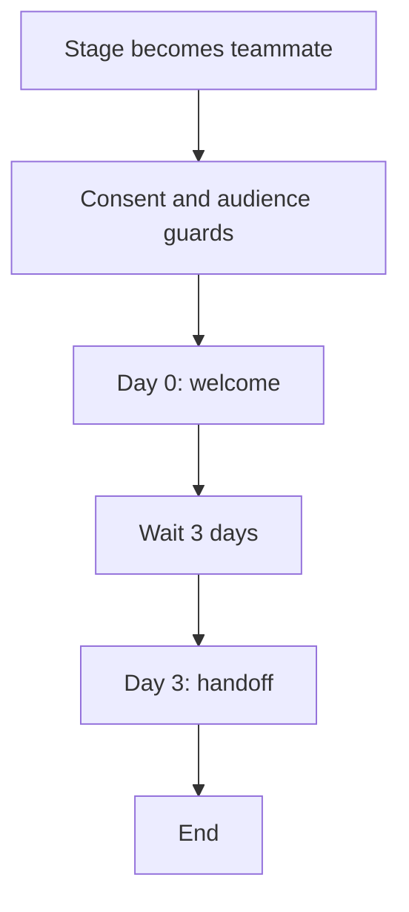
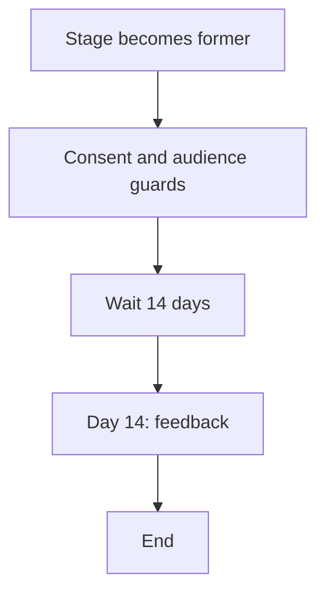

# Cap email catalogue

Generated from the email library with `bun run emails:catalog`. Edit the source files, then regenerate. [Editing guide](README.md).

## Lifecycle flows

These are the locally configured draft journeys. This document is not a live status check. Imports remain held; production enrollment is not deployed. Run `bun run emails:check-loops` to verify the actual Loops drafts.

| Flow | Audience | Schedule after entry | Emails |
| --- | --- | --- | --- |
| [Independent free-user onboarding](https://app.loops.so/workflows/cmtvpih6201fp0jznodf8fpwz) | free | Day 0, Day 2, Day 5, Day 9 | 4 |
| [Customer onboarding](https://app.loops.so/workflows/cmtvpilm601f40jzwx3474cko) | customer | Day 0, Day 3, Day 7 | 3 |
| [Teammate onboarding](https://app.loops.so/workflows/cmtvpm0ag01it0j37w02o6wav) | teammate | Day 0, Day 3 | 2 |
| [Former customer follow-up](https://app.loops.so/workflows/cmtvpm8zm01ii0j01cz7d15qr) | former | Day 14 | 1 |

All journeys require global subscription, positive Cap consent, the exact audience, lifecycle enabled and onboarding eligible. These filters continue to apply downstream. Free/former promotional flows additionally exclude teammates and require promotional eligibility. Customer and teammate flows still require marketing consent.

Teammate history takes priority over paid/free classification. Ambiguous contacts receive no journey. [Audience classification and consent](../scripts/loops/README.md#audience-rules).

### Independent free-user onboarding

Entry: capLifecycleStage changes into free. Re-entry is disabled. Delays below are relative to the previous step; day numbers are cumulative from entry.

Downstream conditions: subscribed isTrue; capConsent equals subscribed; capAudience equals free; capTeammate isFalse; capPromotionalEligible isTrue; capLifecycleEnabled isTrue; capOnboardingEligible isTrue.

| Day | Subject and source | Send condition |
| --- | --- | --- |
| 0 | [Your first Cap can be a small one](../emails/marketing/free-welcome.ts) | Journey guards |
| 2 | [Try a 30-second recording](../emails/marketing/free-record.ts) | `capHasVideo=false` |
| 5 | [Give your next Cap a little context](../emails/marketing/free-share.ts) | `capHasSharedVideo=false` |
| 9 | [Choose the Cap setup that fits your work](../emails/marketing/free-plans.ts) | Journey guards |

### Customer onboarding

Entry: capLifecycleStage changes into customer. Re-entry is disabled. Delays below are relative to the previous step; day numbers are cumulative from entry.

Downstream conditions: subscribed isTrue; capConsent equals subscribed; capAudience equals customer; capLifecycleEnabled isTrue; capOnboardingEligible isTrue.

| Day | Subject and source | Send condition |
| --- | --- | --- |
| 0 | [Thanks for choosing {contact.capPlanName}](../emails/marketing/customer-welcome.ts) | Journey guards |
| 3 | [One explanation you can reuse](../emails/marketing/customer-workflow.ts) | Journey guards |
| 7 | [How is Cap working for you?](../emails/marketing/customer-feedback.ts) | Journey guards |

### Teammate onboarding

Entry: capLifecycleStage changes into teammate. Re-entry is disabled. Delays below are relative to the previous step; day numbers are cumulative from entry.

Downstream conditions: subscribed isTrue; capConsent equals subscribed; capAudience equals teammate; capLifecycleEnabled isTrue; capOnboardingEligible isTrue.

| Day | Subject and source | Send condition |
| --- | --- | --- |
| 0 | [Getting started with your team in Cap](../emails/marketing/teammate-welcome.ts) | Journey guards |
| 3 | [Make your next handoff easier](../emails/marketing/teammate-handoff.ts) | Journey guards |

### Former customer follow-up

Entry: capLifecycleStage changes into former. Re-entry is disabled. Delays below are relative to the previous step; day numbers are cumulative from entry.

Downstream conditions: subscribed isTrue; capConsent equals subscribed; capAudience equals former; capTeammate isFalse; capPromotionalEligible isTrue; capLifecycleEnabled isTrue; capOnboardingEligible isTrue.

| Day | Subject and source | Send condition |
| --- | --- | --- |
| 14 | [What could we have done better?](../emails/marketing/former-feedback.ts) | Journey guards |

## Campaign templates

Campaigns are manually scheduled product updates, with no automatic enrollment. Both require subscription, positive consent and their exact audience. The free template also requires promotional eligibility and excludes teammates.

| Campaign | Audience | Subject and source | Loops ID |
| --- | --- | --- | --- |
| Customer product update template | customer | [What is new in Cap](../emails/marketing/customer-update.ts) | `cmtvpmfxc01ls0j0nnlffombv` |
| Noncustomer product update template | free | [Take another look at Cap](../emails/marketing/free-update.ts) | `cmtvpmjej01kr0j18cxoz2n0y` |

## Branding and personalization

Shared theme, header, signature, sender and fallbacks: [emails/brand.ts](../emails/brand.ts).

Sender: Richie from Cap; local part `richie` on the Loops sending domain. Reply-to: richie@cap.so. Theme: Cap lifecycle v1.

Shared components: Cap lifecycle header v1; Cap lifecycle signature v1.

Customer welcome variations come from [customer-copy.ts](customer-copy.ts); eligibility is resolved from account and license state in the profile sync.

| Plan | Welcome variation |
| --- | --- |
| Cap Pro | Your Cap Pro plan includes cloud sharing and collaboration, plus the desktop commercial license. Open your dashboard to find your organization and manage your setup. |
| Cap Self-hosted | Your self-hosted license supports your own Cap deployment. Use the setup details supplied with your purchase, and reply if you need help. |
| Cap Desktop | Your desktop license covers commercial use of Cap's recorder and editor. Activate it in the desktop app using the license details from your purchase email. |
| Cap | If you need help with your Cap account or access, reply to this email. |

## Marketing email copy

The excerpts below show content, not an email-client render. Branding and required Loops footer content are composed separately.

### free-welcome

Help an independent free user make their first recording.

**Subject:** Your first Cap can be a small one

**Preview:** Pick one thing you would usually explain in a message.

**Variables:** `contact.firstName` (fallback: there)

**Edit:** [emails/marketing/free-welcome.ts](../emails/marketing/free-welcome.ts)

Hi {contact.firstName},

Thanks for trying Cap. A good first recording is something small: a quick explanation, a bug you spotted, or feedback on a piece of work.

Pick one thing you would normally type out, and record it instead. Use Instant Mode for a shareable link, or Studio Mode when you want to edit before exporting.

Download Cap

If you get stuck, reply to this email. We can help.

### free-record

Offer recording help when no cloud video is known.

**Subject:** Try a 30-second recording

**Preview:** A simple way to get comfortable with Cap.

**Variables:** `contact.firstName` (fallback: there)

**Edit:** [emails/marketing/free-record.ts](../emails/marketing/free-record.ts)

Hi {contact.firstName},

Here is an easy way to try Cap: open something you are working on and explain one small part of it out loud.

Choose your screen or a single window, check your microphone, and record for about 30 seconds. No script needed.

If you prefer to keep the recording on your device, use Studio Mode and export it locally.

Open the downloads page

Already recording locally? You are all set. Local recordings do not necessarily appear in your cloud library.

### free-share

Offer sharing guidance when no shared cloud video is known.

**Subject:** Give your next Cap a little context

**Preview:** Help the person watching know what to look for.

**Variables:** `contact.firstName` (fallback: there)

**Edit:** [emails/marketing/free-share.ts](../emails/marketing/free-share.ts)

Hi {contact.firstName},

A recording works best when the person watching knows why you sent it.

Give your Cap a clear title, then send the link with one sentence about what you need: feedback, a decision, or just a quick look.

For a bug report, show what you expected and what happened. For feedback, point to the specific part you want to discuss.

Open your library

### free-plans

Explain current plan options to eligible independent noncustomers.

**Subject:** Choose the Cap setup that fits your work

**Preview:** A desktop license and Cap Pro solve different needs.

**Variables:** `contact.firstName` (fallback: there)

**Edit:** [emails/marketing/free-plans.ts](../emails/marketing/free-plans.ts)

Hi {contact.firstName},

If the free version covers what you need, keep using it.

If you use Cap for work, a Desktop License covers commercial use of the desktop recorder and editor. Cap Pro adds the cloud sharing and collaboration features, and includes the desktop commercial license.

The plans page has the current features and prices, so you can choose based on how you actually use Cap.

Compare Cap plans

Unsure which one fits? Reply with how you use Cap and we will point you in the right direction.

### customer-welcome

Welcome a paying customer with copy matching their paid plan.

**Subject:** Thanks for choosing {contact.capPlanName}

**Preview:** A few useful things to do first.

**Variables:** `contact.capCustomerWelcome` (fallback: Your paid access is ready. If you need help getting started, reply to this email.); `contact.capPlanName` (fallback: Cap); `contact.firstName` (fallback: there)

**Edit:** [emails/marketing/customer-welcome.ts](../emails/marketing/customer-welcome.ts)

Hi {contact.firstName},

Thank you for supporting Cap.

{contact.capCustomerWelcome}

Start with one recording you need to make this week. A walkthrough, a customer explanation, or feedback for a colleague is plenty.

Get Cap

If anything about your setup or access looks wrong, reply and we will help you sort it out.

### customer-workflow

Help a customer build a repeatable recording habit.

**Subject:** One explanation you can reuse

**Preview:** Turn a recurring question into a short recording.

**Variables:** `contact.firstName` (fallback: there)

**Edit:** [emails/marketing/customer-workflow.ts](../emails/marketing/customer-workflow.ts)

Hi {contact.firstName},

One of the most useful things to record is an answer you keep giving.

Pick a recurring question, record a short walkthrough, and give it a title you will recognize later. Trim the beginning and end if you need to, then export or share it in the way that suits your work.

The next time the question comes up, you already have the answer ready.

If you have a workflow you would like Cap to make easier, reply and tell us about it.

### customer-feedback

Ask a customer what is useful and what needs improvement.

**Subject:** How is Cap working for you?

**Preview:** Tell us what is useful and what gets in the way.

**Variables:** `contact.firstName` (fallback: there)

**Edit:** [emails/marketing/customer-feedback.ts](../emails/marketing/customer-feedback.ts)

Hi {contact.firstName},

How has Cap been working for you?

I would love to know what you have been using it for, and whether anything has been confusing or frustrating.

Just reply to this email. Specific examples help us decide what to improve next.

Thanks again for supporting what we are building.

### teammate-welcome

Help an invited teammate find their workspace without promoting upgrades.

**Subject:** Getting started with your team in Cap

**Preview:** Find your workspace and make your first handoff easier.

**Variables:** `contact.firstName` (fallback: there)

**Edit:** [emails/marketing/teammate-welcome.ts](../emails/marketing/teammate-welcome.ts)

Hi {contact.firstName},

Welcome to your team in Cap.

Open your dashboard and make sure the right organization is selected. That is where you will find the recordings your team shares with you.

If something is missing, check with the person who invited you. They can confirm your workspace and access.

Open your workspace

You can also reply here if you need help getting set up.

### teammate-handoff

Help a teammate share useful context with their organization.

**Subject:** Make your next handoff easier

**Preview:** A short recording can give your teammate the context they need.

**Variables:** `contact.firstName` (fallback: there)

**Edit:** [emails/marketing/teammate-handoff.ts](../emails/marketing/teammate-handoff.ts)

Hi {contact.firstName},

For your next handoff, try recording the bit that is difficult to explain in writing.

Show the work, explain what changed, and say what you need from the person watching. A clear title and a short note beside the link make it easier to pick up later.

When sharing, check that the recording is available to the right people in your organization.

Open your workspace

If the team workflow feels awkward anywhere, reply and let us know.

### former-feedback

Ask an eligible former cloud customer for feedback after paid access ends.

**Subject:** What could we have done better?

**Preview:** A quick question about your experience with Cap.

**Variables:** `contact.firstName` (fallback: there)

**Edit:** [emails/marketing/former-feedback.ts](../emails/marketing/former-feedback.ts)

Hi {contact.firstName},

Now that your paid access has ended, I wanted to ask what could have made Cap more useful for you.

Was there something missing, something that did not work properly, or did you just not need it anymore?

Reply if you have a moment. Honest feedback helps us make better decisions.

Thanks for giving Cap a try.

### customer-update

Reusable product update for customers.

**Subject:** What is new in Cap

**Preview:** See the latest improvements in the changelog.

**Variables:** `contact.firstName` (fallback: there)

**Edit:** [emails/marketing/customer-update.ts](../emails/marketing/customer-update.ts)

Hi {contact.firstName},

We have been working on improvements to Cap. You can find the latest changes and fixes in the changelog.

Read the changelog

If something would make Cap more useful for you, reply and tell us.

### free-update

Reusable product update for eligible independent noncustomers.

**Subject:** Take another look at Cap

**Preview:** Catch up on the latest changes.

**Variables:** `contact.firstName` (fallback: there)

**Edit:** [emails/marketing/free-update.ts](../emails/marketing/free-update.ts)

Hi {contact.firstName},

If you have not tried Cap recently, the changelog is a good place to see what has changed.

Download the latest version when you have a recording to make. You can start small and see whether it fits how you work.

See what is new

## Application emails

These are repository send paths and retained templates, not confirmation of production delivery. They continue through Resend and keep their existing React Email layouts. Loops audience filters do not control them. Shared marketing branding does not automatically restyle these templates.

| Email | Trigger | Recipients | Template |
| --- | --- | --- | --- |
| Login verification code | Web or mobile email authentication request | The person signing in | [otp-email](../packages/database/emails/otp-email.tsx) |
| Organization invitation | An organization invitation is issued through the web action or public API | The invited teammate | [organization-invite](../packages/database/emails/organization-invite.tsx) |
| Requested download links | The person requests download links by email | The requesting email address | [download-link](../packages/database/emails/download-link.tsx) |
| First shareable recording | Desktop API creates the first eligible shareable recording | The recording owner | [first-shareable-link](../packages/database/emails/first-shareable-link.tsx) |
| New comment notification | An eligible comment notification is created | The notification recipient | [new-comment](../packages/database/emails/new-comment.tsx) |
| First view notification | An eligible recording receives its first view | The recording owner | [first-view](../packages/database/emails/first-view.tsx) |
| Payment failed / final retry | Stripe invoice payment fails | The billing account user | [payment-failed](../packages/database/emails/payment-failed.tsx) |
| Signed BAA delivery | A business associate agreement is signed | The signer, with the configured notice recipients copied | [signed-baa](../packages/database/emails/signed-baa.tsx) |
| Desktop feedback notification | Legacy desktop feedback handler | Cap support, with the user copied | [feedback](../packages/database/emails/feedback.tsx) |
| Messenger support notification | An eligible support conversation requests an email notification | Cap support; replies go to the user | [messenger-support-email](../packages/database/emails/messenger-support-email.tsx) |
| Account deletion request notification | An account deletion request is submitted | Cap support; replies go to the requester | [messenger-support-email](../packages/database/emails/messenger-support-email.tsx) |
| Mobile content report notification | A mobile content report is submitted | Cap support; replies go to the reporter | [messenger-support-email](../packages/database/emails/messenger-support-email.tsx) |
| Legacy login link template | No current send call found in this checkout | None configured | [login-link](../packages/database/emails/login-link.tsx) |

### Login verification code

OTP authentication; does not subscribe the recipient to marketing.

Send source: [packages/database/auth/auth-options.ts](../packages/database/auth/auth-options.ts), [apps/web/app/api/mobile/[...route]/route.ts](../apps/web/app/api/mobile/%5B...route%5D/route.ts).

### Organization invitation

An invitation is not permission to send promotions.

Send source: [apps/web/actions/organization/send-invites.ts](../apps/web/actions/organization/send-invites.ts), [apps/web/app/api/v1/[...route]/route.ts](../apps/web/app/api/v1/%5B...route%5D/route.ts).

### Requested download links

Uses the existing Resend marketing sender flag; Loops audience filters do not govern this send.

Send source: [apps/web/actions/send-download-link.ts](../apps/web/actions/send-download-link.ts).

### First shareable recording

Scheduled in Resend for five minutes later; uses the existing marketing sender flag. Check overlap before activating Loops recording reminders.

Send source: [apps/web/app/api/desktop/[...route]/video.ts](../apps/web/app/api/desktop/%5B...route%5D/video.ts).

### New comment notification

Notification preferences and exclusions are applied by Notification.ts.

Send source: [apps/web/lib/Notification.ts](../apps/web/lib/Notification.ts).

### First view notification

Notification preferences and first-view checks are applied by Notification.ts.

Send source: [apps/web/lib/Notification.ts](../apps/web/lib/Notification.ts).

### Payment failed / final retry

Different subject and content for the final attempt; deduplicated by invoice and attempt.

Send source: [apps/web/app/api/webhooks/stripe/route.ts](../apps/web/app/api/webhooks/stripe/route.ts).

### Signed BAA delivery

Includes the signed PDF and tracks delivery state; preserve attachment and CC behavior.

Send source: [apps/web/actions/organization/signed-baa.ts](../apps/web/actions/organization/signed-baa.ts).

### Desktop feedback notification

Source-defined handler; inspect route reachability before relying on it.

Send source: [apps/web/app/api/desktop/[...route]/root.ts](../apps/web/app/api/desktop/%5B...route%5D/root.ts).

### Messenger support notification

The support service reserves notification state before sending.

Send source: [apps/web/lib/messenger/support-email.ts](../apps/web/lib/messenger/support-email.ts).

### Account deletion request notification

Deduplicated by deletion request ID.

Send source: [apps/web/lib/account-deletion-request.ts](../apps/web/lib/account-deletion-request.ts).

### Mobile content report notification

Deduplicated by report ID.

Send source: [apps/web/lib/account-deletion-request.ts](../apps/web/lib/account-deletion-request.ts).

### Legacy login link template

Retained source template; current email login uses verification codes.

Send source: No current call site.
