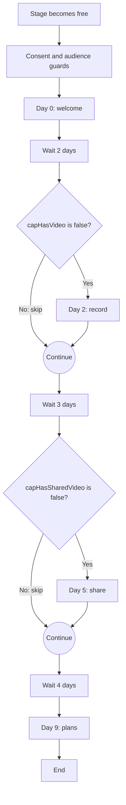
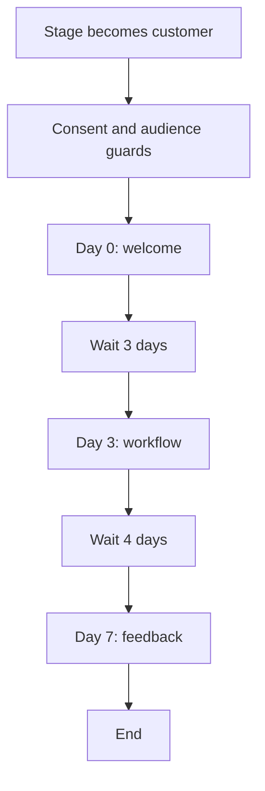
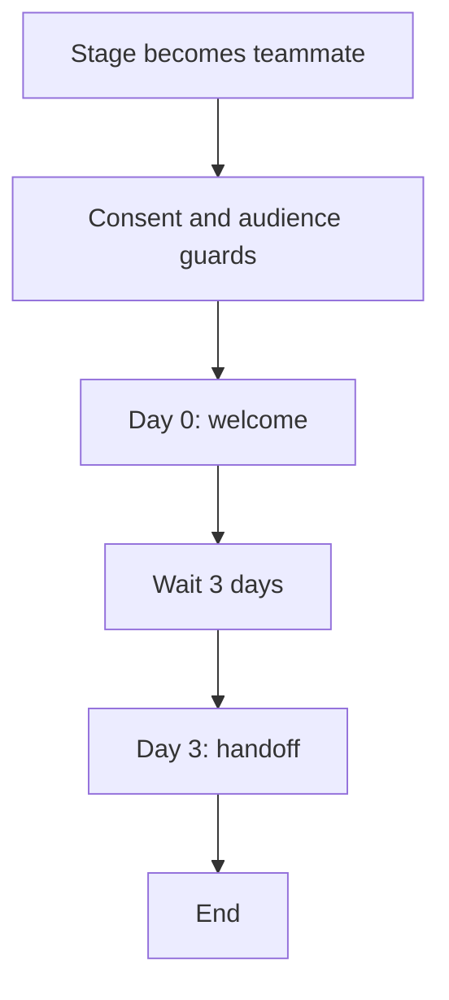
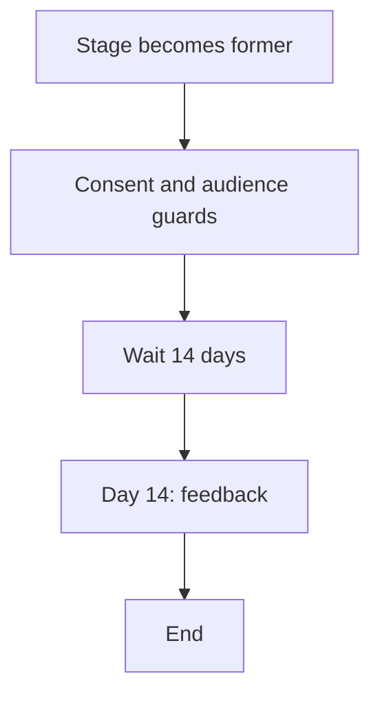

# Cap email catalogue

Generated from the email library with `bun run emails:catalog`. Edit the source files, then regenerate. [Editing guide](README.md).

## Lifecycle flows

These are the locally configured journeys. This document is not a live status check. Imports remain held. Run `bun run emails:check-loops --structure-only --allow-live` to verify the remote workflow structure and status; review custom MJML content in the browser.

| Flow | Audience | Schedule after entry | Emails |
| --- | --- | --- | --- |
| [Independent free-user onboarding](https://app.loops.so/workflows/cmtvpih6201fp0jznodf8fpwz) | free | Day 0, Day 2, Day 5, Day 9 | 4 |
| [Customer onboarding](https://app.loops.so/workflows/cmtvpilm601f40jzwx3474cko) | customer | Day 0, Day 3, Day 7 | 3 |
| [Free activation and Pro conversion v2](https://app.loops.so/workflows/cmtxlhkcw0dta0jzkd6an7xz0) | free | Day 0, Day 1, Day 3, Day 8, Day 10, Day 12 | 6 |
| [Teammate onboarding](https://app.loops.so/workflows/cmtvpm0ag01it0j37w02o6wav) | teammate | Day 0, Day 3 | 2 |
| [Former customer follow-up](https://app.loops.so/workflows/cmtvpm8zm01ii0j01cz7d15qr) | former | Day 14 | 1 |

Completed signups reach Loops through Stripe; SSO uses a small direct fallback. Cap supplies targeting through a durable sync queue, without a separate marketing opt-in step. Existing opt-outs and suppressions take precedence. Historical imports stay held; a new accepted invitation can start teammate help only.

Journeys require global subscription, capConsent=subscribed, the exact audience, lifecycle enabled and onboarding eligible. capConsent is a legacy migration guard, not a separate consent-capture requirement for new signups. These filters continue to apply downstream. Free/former promotional flows additionally exclude teammates and require promotional eligibility.

Teammate history takes priority over paid/free classification. Ambiguous contacts receive no journey. [Audience classification and consent](../scripts/loops/README.md#audience-rules).

The independent watchdog checks every registered journey and alerts when an active flow requires a manual pause. It can hold paused/draft journeys with an impossible subscription condition. Recovery never resumes delivery automatically. Check sync health before campaign sends. See the [outage and resume procedure](../scripts/loops/README.md#outage-protection) and [conversion experiment](conversion-experiment.md).

### Independent free-user onboarding

Entry: capLifecycleStage changes into free. Re-entry is disabled. Delays below are relative to the previous step; day numbers are cumulative from entry.

Downstream conditions: subscribed isTrue; capConsent equals subscribed; capAudience equals free; capTeammate isFalse; capPromotionalEligible isTrue; capLifecycleEnabled isTrue; capOnboardingEligible isTrue.

| Day | Subject and source | Send condition |
| --- | --- | --- |
| 0 | [Welcome to Cap](../emails/marketing/free-welcome.ts) | Journey guards |
| 2 | [A quick way to try Cap](../emails/marketing/free-record.ts) | `capHasVideo=false` |
| 5 | [Send your next explanation as a Cap](../emails/marketing/free-share.ts) | `capHasSharedVideo=false` |
| 9 | [Using Cap for work?](../emails/marketing/free-plans.ts) | Journey guards |

### Customer onboarding

Entry: capLifecycleStage changes into customer. Re-entry is disabled. Delays below are relative to the previous step; day numbers are cumulative from entry.

Downstream conditions: subscribed isTrue; capConsent equals subscribed; capAudience equals customer; capLifecycleEnabled isTrue; capOnboardingEligible isTrue.

| Day | Subject and source | Send condition |
| --- | --- | --- |
| 0 | [Thanks for choosing {contact.capPlanName}](../emails/marketing/customer-welcome.ts) | Journey guards |
| 3 | [One less thing to explain twice](../emails/marketing/customer-workflow.ts) | Journey guards |
| 7 | [How is Cap working for you?](../emails/marketing/customer-feedback.ts) | Journey guards |

### Free activation and Pro conversion v2

Entry: capLifecycleStage changes into free-v2. Re-entry is disabled. Delays below are relative to the previous step; day numbers are cumulative from entry.

Downstream conditions: subscribed isTrue; capConsent equals subscribed; capAudience equals free; capTeammate isFalse; capPromotionalEligible isTrue; capLifecycleEnabled isTrue; capOnboardingEligible isTrue; capLifecycleStage equals free-v2.

```mermaid
flowchart TD
  entry["Stage becomes free-v2"] --> guard["Consent and audience guards"]
  guard --> email0["Day 0: welcome"]
  email0 --> wait1["Wait 1 days"]
  wait1 --> branch1{"capNeedsRecordingHelp is true?"}
  branch1 -->|Yes| email1["Day 1: record"]
  branch1 -->|No: skip| next1((Continue))
  email1 --> next1
  next1 --> wait2["Wait 2 days"]
  wait2 --> branch2{"capReadyForPro is true?"}
  branch2 -->|Yes| email2["Day 3: plans"]
  branch2 -->|No: skip| next2((Continue))
  email2 --> next2
  next2 --> wait3["Wait 5 days"]
  wait3 --> branch3{"capNeedsSharingHelp is true?"}
  branch3 -->|Yes| email3["Day 8: share"]
  branch3 -->|No: skip| next3((Continue))
  email3 --> next3
  next3 --> wait4["Wait 2 days"]
  wait4 --> branch4{"capReadyForPro is true?"}
  branch4 -->|Yes| email4["Day 10: ai"]
  branch4 -->|No: skip| next4((Continue))
  email4 --> next4
  next4 --> wait5["Wait 2 days"]
  wait5 --> branch5{"capNeedsRecordingHelp is true?"}
  branch5 -->|Yes| email5["Day 12: help"]
  branch5 -->|No: skip| next5((Continue))
  email5 --> next5
  next5 --> exit["End"]
```

| Day | Subject and source | Send condition |
| --- | --- | --- |
| 0 | [Your first Cap only needs 30 seconds](../emails/marketing/free-v2-welcome.ts) | Journey guards |
| 1 | [One small thing to record today](../emails/marketing/free-v2-record.ts) | `capNeedsRecordingHelp=true` |
| 3 | [Some explanations need more than five minutes](../emails/marketing/free-v2-plans.ts) | `capReadyForPro=true` |
| 8 | [Put your recording to work](../emails/marketing/free-v2-share.ts) | `capNeedsSharingHelp=true` |
| 10 | [Record the walkthrough. Skip the extra write-up.](../emails/marketing/free-v2-ai.ts) | `capReadyForPro=true` |
| 12 | [Anything getting in the way?](../emails/marketing/free-v2-help.ts) | `capNeedsRecordingHelp=true` |

### Teammate onboarding

Entry: capLifecycleStage changes into teammate. Re-entry is disabled. Delays below are relative to the previous step; day numbers are cumulative from entry.

Downstream conditions: subscribed isTrue; capConsent equals subscribed; capAudience equals teammate; capLifecycleEnabled isTrue; capOnboardingEligible isTrue.

| Day | Subject and source | Send condition |
| --- | --- | --- |
| 0 | [Welcome to your team in Cap](../emails/marketing/teammate-welcome.ts) | Journey guards |
| 3 | [Make your next handoff easier](../emails/marketing/teammate-handoff.ts) | Journey guards |

### Former customer follow-up

Entry: capLifecycleStage changes into former. Re-entry is disabled. Delays below are relative to the previous step; day numbers are cumulative from entry.

Downstream conditions: subscribed isTrue; capConsent equals subscribed; capAudience equals former; capTeammate isFalse; capPromotionalEligible isTrue; capLifecycleEnabled isTrue; capOnboardingEligible isTrue.

| Day | Subject and source | Send condition |
| --- | --- | --- |
| 14 | [Could I ask about your time with Cap?](../emails/marketing/former-feedback.ts) | Journey guards |

## Campaign templates

Campaigns are manually scheduled product updates, with no automatic enrollment. Both require subscription, capConsent=subscribed and their exact audience. The free template also requires promotional eligibility and excludes teammates.

| Campaign | Audience | Subject and source | Loops ID |
| --- | --- | --- | --- |
| Customer product update template | customer | [Keeping up with Cap](../emails/marketing/customer-update.ts) | `cmtvpmfxc01ls0j0nnlffombv` |
| Noncustomer product update template | free | [Take another look at Cap](../emails/marketing/free-update.ts) | `cmtvpmjej01kr0j18cxoz2n0y` |

## Branding and personalization

Shared design, logo, signature, footer, sender and fallbacks: [emails/brand.ts](../emails/brand.ts). Custom MJML delivery is generated by [emails/mjml.ts](../emails/mjml.ts).

Sender: Richie from Cap; local part `richie` on the Loops sending domain. Reply-to: richie@cap.so.

The shared header uses the canonical Cap icon and vector wordmark, with white backing for contrast on dark backgrounds. The complete greeting is `capGreeting`, with `Hey,` as its fallback. One compact footer contains the company, address and unsubscribe link.

Customer welcome variations come from [customer-copy.ts](customer-copy.ts); eligibility is resolved from account and license state in the profile sync.

| Plan | Welcome variation |
| --- | --- |
| Cap Pro | With Cap Pro, you can share recordings with a link and work on them with your team. Your plan also includes the desktop commercial license, so you can use Cap for client work too. |
| Cap Self-hosted | For your self-hosted setup, start with the instructions supplied with your purchase. If you get stuck anywhere, reply with what you're seeing and I'll help you sort it. |
| Cap Desktop | Your desktop license lets you use Cap's recorder and editor for commercial work. You can activate it in the app with the license details from your purchase email. |
| Cap | If you need a hand getting set up, just reply and I'll help you sort it. |

## Marketing email copy

The excerpts below show content, not an email-client render. Branding and required Loops footer content are composed separately.

### free-welcome

Help an independent free user make their first recording.

**Subject:** Welcome to Cap

**Preview:** Richie here. Great to have you with us :)

**Variables:** `contact.capGreeting` (fallback: Hey,)

**Edit:** [emails/marketing/free-welcome.ts](../emails/marketing/free-welcome.ts)

{contact.capGreeting}

Richie here, founder of Cap. Thanks for giving it a go :)

The easiest way to start is to record something you'd normally type out. A quick explanation or a bit of feedback is plenty.

Use Instant Mode when you want a shareable link, or Studio Mode to edit your recording and export it locally.

Download Cap here.

If you have any questions, just reply to this email. I'd love to help.

### free-record

Offer recording help when no cloud video is known.

**Subject:** A quick way to try Cap

**Preview:** You don't need a script or a perfect take.

**Variables:** `contact.capGreeting` (fallback: Hey,)

**Edit:** [emails/marketing/free-record.ts](../emails/marketing/free-record.ts)

{contact.capGreeting}

If you're still finding your feet with Cap, try this: open something on your screen and spend 30 seconds explaining it out loud.

No script or perfect take needed. In Studio Mode, you can trim it afterwards and keep the recording on your own device.

Need the app? You can download Cap here.

If something's stopping you from recording, reply and let me know what happened. I'll help you sort it.

### free-share

Offer sharing guidance when no shared cloud video is known.

**Subject:** Send your next explanation as a Cap

**Preview:** A short recording and one sentence are enough.

**Variables:** `contact.capGreeting` (fallback: Hey,)

**Edit:** [emails/marketing/free-share.ts](../emails/marketing/free-share.ts)

{contact.capGreeting}

Next time you're typing a long explanation, try showing it in Cap instead.

Record the bit that's hard to explain, then send the link with a sentence about what you need. Something like: “Here's the bug I mentioned. Can you see the same thing?”

It doesn't have to be polished to be useful.

Open your Cap library.

### free-plans

Explain current plan options to eligible independent noncustomers.

**Subject:** Using Cap for work?

**Preview:** Here's how the Desktop License and Cap Pro compare.

**Variables:** `contact.capGreeting` (fallback: Hey,)

**Edit:** [emails/marketing/free-plans.ts](../emails/marketing/free-plans.ts)

{contact.capGreeting}

If you're thinking about using Cap for work, there are two options.

A Desktop License covers commercial use of the recorder and editor. It's a good fit if you mainly edit and export videos yourself.

Cap Pro adds cloud sharing and collaboration, and includes the desktop commercial license. That's the one to look at if you're sharing recordings with clients or your team.

Compare the plans here.

Not sure which you need? Reply with what you're using Cap for and I'll point you in the right direction.

### customer-welcome

Welcome a paying customer with copy matching their paid plan.

**Subject:** Thanks for choosing {contact.capPlanName}

**Preview:** Thanks for backing what we're building.

**Variables:** `contact.capCustomerWelcome` (fallback: If you need a hand getting set up, just reply and I'll help you sort it.); `contact.capPlanName` (fallback: Cap); `contact.capGreeting` (fallback: Hey,)

**Edit:** [emails/marketing/customer-welcome.ts](../emails/marketing/customer-welcome.ts)

{contact.capGreeting}

Richie here, founder of Cap. Thanks so much for supporting what we're building. It means a lot.

{contact.capCustomerWelcome}

What are you planning to use Cap for? Just reply and let me know. I'd love to hear.

### customer-workflow

Help a customer build a repeatable recording habit.

**Subject:** One less thing to explain twice

**Preview:** A recording you can keep coming back to.

**Variables:** `contact.capGreeting` (fallback: Hey,)

**Edit:** [emails/marketing/customer-workflow.ts](../emails/marketing/customer-workflow.ts)

{contact.capGreeting}

A quick idea for your next recording: pick a question you keep answering and record the walkthrough once.

It could be how to set something up, where to find a setting, or how you want a piece of work done. Give it a title you'll recognise later, then save or share it wherever you normally answer that question.

The next time someone asks, you've already got it ready.

Anything making that harder than it should be? Reply and tell me.

### customer-feedback

Ask a customer what is useful and what needs improvement.

**Subject:** How is Cap working for you?

**Preview:** I'd love to hear what's working and what isn't.

**Variables:** `contact.capGreeting` (fallback: Hey,)

**Edit:** [emails/marketing/customer-feedback.ts](../emails/marketing/customer-feedback.ts)

{contact.capGreeting}

How are you getting on with Cap?

I'd love to know if there's anything you wish worked differently, or something that's getting in your way.

Just reply here. I read every reply, and hearing how people actually use Cap helps me decide what we should work on next.

Thanks again for backing us :)

### free-v2-welcome

Help a new independent free user record and share one useful explanation.

**Subject:** Your first Cap only needs 30 seconds

**Preview:** Record one thing, send the link, and you're off.

**Variables:** `contact.capGreeting` (fallback: Hey,)

**Edit:** [emails/marketing/free-v2-welcome.ts](../emails/marketing/free-v2-welcome.ts)

{contact.capGreeting}

Richie here, founder of Cap. Thanks for giving it a go :)

For your first recording, pick something you'd normally explain in a long message. Open Cap, choose Instant Mode, and spend 30 seconds showing it on screen.

Once it's ready, send the link to someone who needs that explanation. No polished presentation needed.

Download Cap and make your first recording

If you get stuck, reply here and I'll help.

### free-v2-record

Offer a small first cloud recording task when no completed video is visible.

**Subject:** One small thing to record today

**Preview:** Try explaining something you already know.

**Variables:** `contact.capGreeting` (fallback: Hey,)

**Edit:** [emails/marketing/free-v2-record.ts](../emails/marketing/free-v2-record.ts)

{contact.capGreeting}

If you're still finding your feet with Cap, try recording a quick walkthrough of something you already know: a setting, a page, or a problem you want to show someone.

Choose Instant Mode, keep it short, then send the link when it's ready.

Get started with your first recording

If screen or microphone permissions are getting in the way, reply with what you're seeing and I'll help you sort it.

### free-v2-plans

Offer Pro to active free users through a specific cloud-sharing benefit.

**Subject:** Some explanations need more than five minutes

**Preview:** Share the full walkthrough with Cap Pro.

**Variables:** `contact.capGreeting` (fallback: Hey,)

**Edit:** [emails/marketing/free-v2-plans.ts](../emails/marketing/free-v2-plans.ts)

{contact.capGreeting}

Five minutes works for a quick question. A full walkthrough sometimes needs longer.

Cap Pro removes the five-minute limit on cloud recordings and gives you unlimited shareable links, so you can send the whole explanation in one video.

It also includes the desktop commercial license for work recordings.

Pro is US$12 per user, billed monthly. Annual billing is also available.

Upgrade to Cap Pro

### free-v2-share

Help an active user put a completed recording into a real conversation.

**Subject:** Put your recording to work

**Preview:** Send the link with one sentence about what you need.

**Variables:** `contact.capGreeting` (fallback: Hey,)

**Edit:** [emails/marketing/free-v2-share.ts](../emails/marketing/free-v2-share.ts)

{contact.capGreeting}

A useful way to share a Cap is to add one sentence telling the other person what you need from them.

"Here's the bit I'm stuck on. Can you take a look?"

Or: "Here's how to change that setting. Does that solve it?"

Open your recordings

Send the link wherever you're already having the conversation.

### free-v2-ai

Show active free users how Pro reduces the work around a recording.

**Subject:** Record the walkthrough. Skip the extra write-up.

**Preview:** Give people a summary and chapters alongside your video.

**Variables:** `contact.capGreeting` (fallback: Hey,)

**Edit:** [emails/marketing/free-v2-ai.ts](../emails/marketing/free-v2-ai.ts)

{contact.capGreeting}

A recording saves you typing everything out. Writing a summary afterwards can feel like doing the job twice.

Cap Pro generates a title, summary, transcript and clickable chapters for your recordings. The person watching can get the context, then jump to the part they need.

That's especially useful for walkthroughs people come back to later.

See Cap Pro

### free-v2-help

Invite a reply from users who have not reached a completed cloud recording.

**Subject:** Anything getting in the way?

**Preview:** Reply and tell me where you're getting stuck.

**Variables:** `contact.capGreeting` (fallback: Hey,)

**Edit:** [emails/marketing/free-v2-help.ts](../emails/marketing/free-v2-help.ts)

{contact.capGreeting}

If you haven't found a useful way to fit Cap into your day yet, is anything getting in the way?

Maybe you're not sure what to record, something isn't working, or it isn't quite what you expected.

Reply and let me know. If I can help you get a useful first recording out of it, I'd like to.

### teammate-welcome

Help an invited teammate find their workspace without promoting upgrades.

**Subject:** Welcome to your team in Cap

**Preview:** Here's where to find your team's recordings.

**Variables:** `contact.capGreeting` (fallback: Hey,)

**Edit:** [emails/marketing/teammate-welcome.ts](../emails/marketing/teammate-welcome.ts)

{contact.capGreeting}

Richie here, founder of Cap. Great to have you with us :)

Open your dashboard and select your team's organisation. You'll find the recordings they've shared with you there.

If you can't see the right organisation, check with the person who invited you. They can confirm which email address they used and your access.

You can also reply here if you need a hand.

### teammate-handoff

Help a teammate share useful context with their organization.

**Subject:** Make your next handoff easier

**Preview:** Show your teammate the bit that's hard to put into words.

**Variables:** `contact.capGreeting` (fallback: Hey,)

**Edit:** [emails/marketing/teammate-handoff.ts](../emails/marketing/teammate-handoff.ts)

{contact.capGreeting}

Next time you hand something over to a teammate, try recording the part that's tricky to explain in a message.

Show what changed and what you need them to look at. Even a short recording can save a lot of back and forth.

Open your team workspace. Before sending a recording, check its sharing settings so the right people can watch it.

If anything about sharing with your team feels awkward, reply and let me know.

### former-feedback

Ask an eligible former cloud customer for feedback after paid access ends.

**Subject:** Could I ask about your time with Cap?

**Preview:** I'd appreciate your honest feedback.

**Variables:** `contact.capGreeting` (fallback: Hey,)

**Edit:** [emails/marketing/former-feedback.ts](../emails/marketing/former-feedback.ts)

{contact.capGreeting}

Could I ask what made you decide to stop using your paid Cap plan?

Was something missing, did something not work properly, or did you just not need it anymore?

If you've got a moment to reply, I'd really appreciate it. And if there was a problem I can help with, I'd like to try.

Thanks for giving Cap a go.

### customer-update

Evergreen changelog invitation for customers; review before each campaign.

**Subject:** Keeping up with Cap

**Preview:** The changes we've shipped, all in one place.

**Variables:** `contact.capGreeting` (fallback: Hey,)

**Edit:** [emails/marketing/customer-update.ts](../emails/marketing/customer-update.ts)

{contact.capGreeting}

Just a quick one from me. If you're wondering what's changed in Cap, we keep the features and fixes together in our changelog.

Here's what we've shipped.

Is there something you're still waiting for us to build or fix? Reply and let me know. Hearing what's missing is just as useful as hearing what's working.

### free-update

Evergreen reactivation invitation for eligible independent noncustomers; review before each campaign.

**Subject:** Take another look at Cap

**Preview:** Was something missing when you tried it?

**Variables:** `contact.capGreeting` (fallback: Hey,)

**Edit:** [emails/marketing/free-update.ts](../emails/marketing/free-update.ts)

{contact.capGreeting}

If it's been a while since you tried Cap, I'd love for you to take another look.

You can see what's changed here. Next time you need to explain something on screen, give it a go.

If something put you off last time, just reply and tell me. I'd like to know, especially if it was something we could have done better.

## Application emails

These are repository send paths and retained templates, not confirmation of production delivery. They continue through Resend and keep their existing React Email layouts. Loops audience filters do not control them. Shared marketing branding does not automatically restyle these templates.

| Email | Trigger | Recipients | Template |
| --- | --- | --- | --- |
| Login verification code | Web or mobile email authentication request | The person signing in | [otp-email](../packages/database/emails/otp-email.tsx) |
| Organization invitation | An organization invitation is issued through the web action or public API | The invited teammate | [organization-invite](../packages/database/emails/organization-invite.tsx) |
| Requested download links | The person requests download links by email | The requesting email address | [download-link](../packages/database/emails/download-link.tsx) |
| First shareable recording | Desktop API creates the first eligible shareable recording | The recording owner | [first-shareable-link](../packages/database/emails/first-shareable-link.tsx) |
| New comment notification | An eligible comment notification is created | The notification recipient | [new-comment](../packages/database/emails/new-comment.tsx) |
| First view notification | An eligible recording receives its first view | The recording owner | [first-view](../packages/database/emails/first-view.tsx) |
| Payment failed / final retry | Stripe invoice payment fails | The billing account user | [payment-failed](../packages/database/emails/payment-failed.tsx) |
| Signed BAA delivery | A business associate agreement is signed | The signer, with the configured notice recipients copied | [signed-baa](../packages/database/emails/signed-baa.tsx) |
| Desktop feedback notification | Legacy desktop feedback handler | Cap support, with the user copied | [feedback](../packages/database/emails/feedback.tsx) |
| Messenger support notification | An eligible support conversation requests an email notification | Cap support; replies go to the user | [messenger-support-email](../packages/database/emails/messenger-support-email.tsx) |
| Account deletion request notification | An account deletion request is submitted | Cap support; replies go to the requester | [messenger-support-email](../packages/database/emails/messenger-support-email.tsx) |
| Mobile content report notification | A mobile content report is submitted | Cap support; replies go to the reporter | [messenger-support-email](../packages/database/emails/messenger-support-email.tsx) |
| Legacy login link template | No current send call found in this checkout | None configured | [login-link](../packages/database/emails/login-link.tsx) |

### Login verification code

OTP authentication; does not subscribe the recipient to marketing.

Send source: [packages/database/auth/auth-options.ts](../packages/database/auth/auth-options.ts), [apps/web/app/api/mobile/[...route]/route.ts](../apps/web/app/api/mobile/%5B...route%5D/route.ts).

### Organization invitation

An invitation is not permission to send promotions.

Send source: [apps/web/actions/organization/send-invites.ts](../apps/web/actions/organization/send-invites.ts), [apps/web/app/api/v1/[...route]/route.ts](../apps/web/app/api/v1/%5B...route%5D/route.ts).

### Requested download links

Uses the existing Resend marketing sender flag; Loops audience filters do not govern this send.

Send source: [apps/web/actions/send-download-link.ts](../apps/web/actions/send-download-link.ts).

### First shareable recording

Scheduled in Resend for five minutes later; uses the existing marketing sender flag. Check overlap before activating Loops recording reminders.

Send source: [apps/web/app/api/desktop/[...route]/video.ts](../apps/web/app/api/desktop/%5B...route%5D/video.ts).

### New comment notification

Notification preferences and exclusions are applied by Notification.ts.

Send source: [apps/web/lib/Notification.ts](../apps/web/lib/Notification.ts).

### First view notification

Notification preferences and first-view checks are applied by Notification.ts.

Send source: [apps/web/lib/Notification.ts](../apps/web/lib/Notification.ts).

### Payment failed / final retry

Different subject and content for the final attempt; deduplicated by invoice and attempt.

Send source: [apps/web/app/api/webhooks/stripe/route.ts](../apps/web/app/api/webhooks/stripe/route.ts).

### Signed BAA delivery

Includes the signed PDF and tracks delivery state; preserve attachment and CC behavior.

Send source: [apps/web/actions/organization/signed-baa.ts](../apps/web/actions/organization/signed-baa.ts).

### Desktop feedback notification

Source-defined handler; inspect route reachability before relying on it.

Send source: [apps/web/app/api/desktop/[...route]/root.ts](../apps/web/app/api/desktop/%5B...route%5D/root.ts).

### Messenger support notification

The support service reserves notification state before sending.

Send source: [apps/web/lib/messenger/support-email.ts](../apps/web/lib/messenger/support-email.ts).

### Account deletion request notification

Deduplicated by deletion request ID.

Send source: [apps/web/lib/account-deletion-request.ts](../apps/web/lib/account-deletion-request.ts).

### Mobile content report notification

Deduplicated by report ID.

Send source: [apps/web/lib/account-deletion-request.ts](../apps/web/lib/account-deletion-request.ts).

### Legacy login link template

Retained source template; current email login uses verification codes.

Send source: No current call site.
